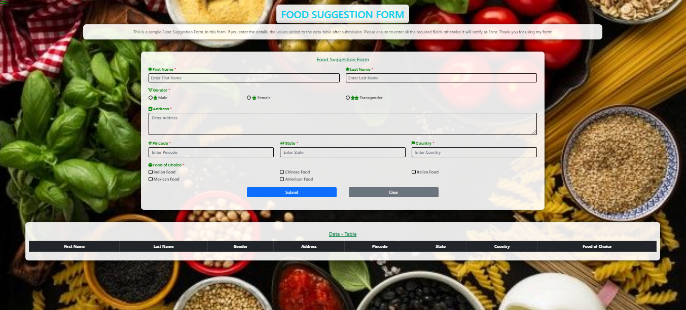

# Food Suggestion Form

It's sample Food Suggestion Form which was designed by me. It's my Guvi-Zen class Day-15 (Dom : Day-3) Task.

## Tech Stack

- HTML
- CSS
- Javascript
- Bootstrap

## Lessons Learned

I learned to implement HTML Elements manipulation in Javascript using DOM and some specified classes in Bootstrap during this project

## Features

- Responsive Design

## Website

[My_Food_Suggestion_Form](https://food-suggestion-form.vercel.app/)

## Screenshots

## Feedback

If you have any feedback, please reach out to me at vijaymayhul@gmail.com
